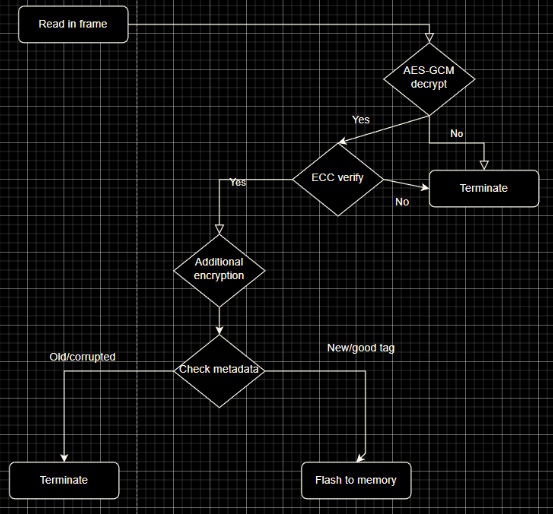

# Welcome

Hey, 👋 I'm Jayden. I currently attend Texas A&M, CO '27. Let's go Aggies! 
I graduated from a health professions 🩺 high school, DeBakey High School in Houston, Texas but my interests lie in software 🤖 and cybersecurity ⚔️🛡️.
I enjoy bouldering 🧗‍♂️, working out 🏋️, folding origami 🦢, and playing CTFs 🚩 in my free time.

This is my open book project where I share my ideas, experiences, and knowledge!

> Check out my [blog], [portfolio], and [resume].
{:.lead}

1. Table Of Contents
{:toc .large-only}

# Professional Experience 💼

### BWSI Intern (2023 - present) 🦫
During the summer, MIT's Lincoln Laboratory hosts an immersive 4-week program known as BeaverWorks Summer Institute (BWSI), aimed at imparting high school students with advanced technical skills. Within this dynamic environment, I had the privilege of guiding the Embedded Security and Hardware Hacking course, a program I once enjoyed as a student and now returned to as a Teaching Assistant.

*The* highlight of the program was our capstone competition, where teams engaged in a thrilling pursuit to uncover hidden flags within other teams software, employing techniques commonly exploited in practical cybersecurity scenarios. From navigating malicious firmware to deciphering encryption keys and extracting data from flash memory, students encountered and conquered challenges mirroring those encountered by industry professionals.

However, beyond the technical aspects, this experience provided invaluable lessons in pedagogy and empathy. Guiding students through the complexities of embedded systems demanded a shift in perspective, compelling me to break down intricate concepts into digestible, human-intuitive explanations. Moreover, it sharpened my ability to recognize the subtle signs of struggle among students, fostering an environment where they felt supported and encouraged to seek assistance.

# Certifications 📜

### Practical Networking Penetration Tester (PNPT) Certificate (2024) 🌐

The Practical Network Penetration Tester™ (PNPT) certification is an intermediate-level penetration testing exam experience.  This exam will assess a student’s ability to perform a network penetration test at an professional level.  Students will have five (5) full days to complete the assessment and an additional two (2) days to write a professional report utiziling industry standard tactics, techniques, and procedures with Open-Source Intelligence (OSINT), Active Directory exploitation, and internal network enumeration.

I expect to complete the course and pass the exam in Summer 2024.

[Example Writeup & Report]

### Offensive Security Certified Professional (OSCP) (2024) 🗡️

The industry-leading Penetration Testing with Kali Linux (PWK/PEN-200) course introduces penetration testing methodologies, tools, and techniques in a hands-on, self-paced environment. Learners who complete the course and pass the exam will earn the OffSec Certified Professional (OSCP) certification which requires holders to successfully attack and penetrate various live machines in a safe lab environment. This on top of the OSCP includes binary exploitation and more advanced Linux exploitation.

I expect to complete the course and pass the exam in Fall 2024. 

# Technical Projects ⚙️

### Technical Analysis (July 2023 - present) 📈

> Swing trading is a style of trading that attempts to capture short- to medium-term gains in a stock (or any financial instrument) over a period of a few days to several weeks. Swing traders primarily use **technical analysis** to look for trading opportunities.

I use stochastic analysis with various technical indicators to predict optimal entry and exit times to capture the nature, random market fluctuations. Then I test that strategy across various iterations of historical market data to find the optimal strategy.

This is an example of an exit strategy that utilized predictive KDJ crossovers on historic data.

### Firmware Distribution System (Summer 2022) 💻

Under the guidance of MITRE teachers (praise Iv Robinson) we taught our students how to design and deploy a firmware updating protocol for an offsite bootloader. After deployment, we hide flags in the hardware and held a competition for whichever team could capture the most flags using commonly exploited vulnerabilites in the real world like booting maclious firmware, finding the encryption key, and dumping flash memory.

[GitHub Repo](https://github.com/NebuDev14/firmware-distribution-system)

### Embedded Hacking and Reverse Engineering (Early 2021 - present) 🔁👨🏻‍💻🛠

> Embedded systems security is a cybersecurity field focused on preventing malicious access to and use of embedded systems.

> The process of taking a piece of software or hardware and analyzing its functions and information flow so that its functionality and behavior can be understood. Malware is commonly reverse-engineered in cyber defense.

Most [CTFs](https://ctftime.org/ctf-wtf/) are structured into 5 distinct categories, web, pwn, crypto, forensics/misc, and reversing, of which I chose reverse engineering to be my specialty. Because of my informal learning style I just learned from whatever resources I could find, even though they were probably not targeted towards my direct interest, they still did provide suplemental value. Most of the theoretical reversing I've learned comes from [Reverse_Engineering-Wiley(2005)](https://www.wiley.com/en-us/Reversing%3A+Secrets+of+Reverse+Engineering+-p-9781118079768) which goes over Assembly, computer architecture, and a variety of reversing topics.

In addition to my self-learning, I also participated in the Embedded Security and Hardware Hacking course from MIT's Lincoln Lab at [BWSI](/events#mit-beaverworks-2022). During this course, I learned more about the finer details of cryptographic vulnerabilities, low level computer programming, and a more formal approach to the embedded design process. The final design project of our class being an exciting A/D (attack and defense) style CTF competition where teams of 4 students wrote bootloader and utility programs that could remotely update an embedded system while other teams tried to exploit vulnerabilities in their code and hack their systems.

Here are examples of some of the reverse engineering CTF challenges I've written: [RollingOnMyOwn](https://github.com/jkohhokj/jkohhokj2.github.io/blob/main/assets/Rolling On My Own) and [SlowMaffs](https://github.com/jkohhokj/jkohhokj2.github.io/blob/main/assets/SlowMaffs - Rev) for [idekCTF 2021](https://ctftime.org/event/1512/) and [Digital Overdose Autumn 2021](https://ctftime.org/event/1459), respectively.

Here are some of the writeups for challenges I've solved through my CTF career: [some basic static analysis chall](https://github.com/jkohhokj/jkohhokj2.github.io/blob/main/assets/writeups/loading.md), [insecure AES implementation chall](https://github.com/jkohhokj/jkohhokj2.github.io/blob/main/assets/writeups/lupus.md), [keygen chall](https://github.com/jkohhokj/jkohhokj2.github.io/blob/main/assets/writeups/sanity.md), [low level algo chall](https://github.com/jkohhokj/jkohhokj2.github.io/blob/main/assets/writeups/sub.md), and a [tutorial chall](https://github.com/jkohhokj/jkohhokj2.github.io/blob/main/assets/writeups/Walkthrough%20of%20Intro%20to%20Ghidra.md).

I even wrote a little [guide](https://github.com/jkohhokj/jkohhokj2.github.io/blob/main/assets/Rev.md) on getting started on CTF reversing :p

# Lifestyle Activities 🌱

### Lifting (April 2022 - present) 🏋️

> Weight training is a common type of strength training for developing the strength, size of skeletal muscles and maintenance of strength. It uses the force of gravity in the form of weighted bars, dumbbells or weight stacks in order to oppose the force generated by muscle through concentric or eccentric contraction.

Stats:
- Deadlift: 370
- Squat: 355
- Bench: 240

[Fitness & Gym Instagram](https://www.instagram.com/jkoh.jimbro/)

### Rock Climbing (August 2022 - present) 🧗‍♂️

> Bouldering is a form of free climbing that is performed on small rock formations or artificial rock walls without the use of ropes or harnesses.

Rock climbing taps into my problem solving tendencies and physical drive to ascend.

Hardest ascents:

Bouldering: V6, Momentum Silver Street

Top Rope: 5.12a, Momentum Katy

### Maps of Meaning/Personality (Spring 2021): 🗺️

> Maps of Meaning lays bare the grammar of mythology, and describes the relevance of that grammar for interpretation of narrative and religion, comprehension of ideological identification, and understanding of the role that individual choice plays in the maintenance, transformation and destiny of social systems.

[Course page](https://www.jordanbpeterson.com/classes/psychology-434/) and [YouTube link](https://www.youtube.com/watch?v=I8Xc2_FtpHI&list=PL22J3VaeABQAT-0aSPq-OKOpQlHyR4k5h)

> Personality is a way of looking at the world, and a characteristic mode of behaving. It's both stable and adaptively dynamic.

[Course page](https://www.jordanbpeterson.com/classes/personality-and-its-transformations/) and [YouTube link](https://www.youtube.com/watch?v=kYYJlNbV1OM&list=PL22J3VaeABQApSdW8X71Ihe34eKN6XhCi)

The lecture series "2017 Maps of Meaning" is a 4th year, 12-video lecture series for psychology students from the University of Toronto by Jordan Peterson based on his book titled "Maps of Meaning: The Architecture of Belief." In accordance with finishing the entire course over the summer of 2021 when I literally had nothing better to do, I had compiled about 50 full pages (25,170 words) worth of notes and introspection. This lecture course adapted the Jungian and Freudian perspectives of psychology regarding cultural archetypes with the new advancement in neuroscience and biology and has largely shaped my viewpoint on how cultures and individuals interplay with reality on a metaphysical and physiological level. Below I have compiled some of the recurrent themes (and their complement) that I've interpreted from the lecture.

Essential themes:

- Order and Chaos/Masculinity and Femininity
- Responsibility and Rights => Individual and Government
- Subjectivity and Objectivity
- Tyranny and Justice
- Enlightenment and Ignorance
- Frames of reference and Hierarchy
- Nihilism and Hedonism

"2017 Personality and its Transformation" is a lecture series for 2nd year psychology students at UoT also by Professor Peterson which describes the different modes of being in the world. Again, I have finished the entire course with roughly 40 full pages (20,370 words) of notes after I had finished the Maps of Meaning lecture series. This class was more based in the biological perspective of psychology and brought the context into the current political and social environment, compared to the abstracted "collective unconscious" Maps of Meaning was based on. As a side note, throughout both of these classes, I've realized that my notes have significantly improved in quality because of the new method I tried out. Additionally, I've found a lot of great readings from writers such as Orwell and Solzhenitsyn.

I've always found it difficult to integrate this aspect of my life when representing myself like writing my resume and simply answering the question "What have you done/accomplished?" because the philosophical and psychological knowledge can't be as directly expressed as some of my other interests and tend to be overshadowed by the more tangible, immediately recognizable achievements.

## Blog

## Download



## Just Markdown
Write all content with Markdown. __Hydejack__ gives you [additional CSS classes](docs/writing.md) to stylize your content, without losing compatibility with other Jekyll themes.

## Comparison



[blog]: /
[portfolio]: https://github.com/jkohhokj
[resume]: /assets/Resume-Spring-2024.8.pdf
[download]: https://hydejack.com/download/
[welcome]: https://jkoh.dev/
[forms]: https://hydejack.com/forms-by-example/

[features]: #features
[news]: #build-an-audience
[syntax]: syntax-highlighting
[latex]: #beautiful-math
[dark]: https://hydejack.com/blog/hydejack/2018-09-01-introducing-dark-mode/
[search]: https://hydejack.com/#_search-input
[grid]: https://hydejack.com/blog/hydejack/

[lic]: LICENSE.md
[pro]: licenses/PRO.md
[docs]: docs/README.md
[ofln]: docs/advanced.md#enabling-offline-support
[math]: docs/writing.md#adding-math

[kit]: https://github.com/hydecorp/hydejack-starter-kit/releases
[src]: https://github.com/hydecorp/hydejack
[gem]: https://rubygems.org/gems/jekyll-theme-hydejack
[buy]: https://gum.co/nuOluY

[gpss]: https://developers.google.com/speed/pagespeed/insights/?url=https%3A%2F%2Fhydejack.com%2Fdocs%2F
[rouge]: http://rouge.jneen.net
[katex]: https://khan.github.io/KaTeX/
[mathjax]: https://www.mathjax.org/
[tinyletter]: https://tinyletter.com/
