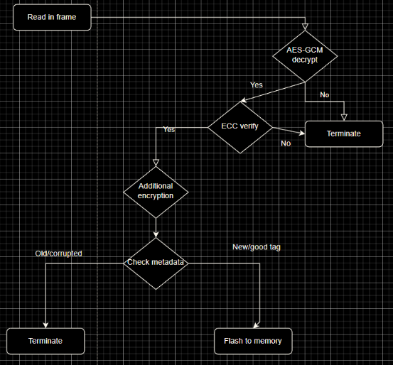

# Technical Projects ⚙️

1. Table Of Contents
{:toc .large-only}

### Technical Analysis (July 2023 - present) 📈

> Swing trading is a style of trading that attempts to capture short- to medium-term gains in a stock (or any financial instrument) over a period of a few days to several weeks. Swing traders primarily use **technical analysis** to look for trading opportunities.

I use stochastic analysis with various technical indicators to predict optimal entry and exit times to capture the nature, random market fluctuations. Then I test that strategy across various iterations of historical market data to find the optimal strategy.

This is an example of an exit strategy that utilized predictive KDJ crossovers on historic data.

### Firmware Distribution System (Summer 2022) 💻

Under the guidance of MITRE teachers (praise Iv Robinson) we taught our students how to design and deploy a firmware updating protocol for an offsite bootloader. After deployment, we hide flags in the hardware and held a competition for whichever team could capture the most flags using commonly exploited vulnerabilites in the real world like booting maclious firmware, finding the encryption key, and dumping flash memory.

[GitHub Repo](https://github.com/NebuDev14/firmware-distribution-system)

### Embedded Hacking and Reverse Engineering (Early 2021 - present) 🔁👨🏻‍💻🛠

> Embedded systems security is a cybersecurity field focused on preventing malicious access to and use of embedded systems.

> The process of taking a piece of software or hardware and analyzing its functions and information flow so that its functionality and behavior can be understood. Malware is commonly reverse-engineered in cyber defense.

Most [CTFs](https://ctftime.org/ctf-wtf/) are structured into 5 distinct categories, web, pwn, crypto, forensics/misc, and reversing, of which I chose reverse engineering to be my specialty. Because of my informal learning style I just learned from whatever resources I could find, even though they were probably not targeted towards my direct interest, they still did provide suplemental value. Most of the theoretical reversing I've learned comes from [Reverse_Engineering-Wiley(2005)](https://www.wiley.com/en-us/Reversing%3A+Secrets+of+Reverse+Engineering+-p-9781118079768) which goes over Assembly, computer architecture, and a variety of reversing topics.

In addition to my self-learning, I also participated in the Embedded Security and Hardware Hacking course from MIT's Lincoln Lab at [BWSI](/events#mit-beaverworks-2022). During this course, I learned more about the finer details of cryptographic vulnerabilities, low level computer programming, and a more formal approach to the embedded design process. The final design project of our class being an exciting A/D (attack and defense) style CTF competition where teams of 4 students wrote bootloader and utility programs that could remotely update an embedded system while other teams tried to exploit vulnerabilities in their code and hack their systems.

Here are examples of some of the reverse engineering CTF challenges I've written: [RollingOnMyOwn](https://github.com/jkohhokj/jkohhokj2.github.io/blob/main/assets/Rolling On My Own) and [SlowMaffs](https://github.com/jkohhokj/jkohhokj2.github.io/blob/main/assets/SlowMaffs - Rev) for [idekCTF 2021](https://ctftime.org/event/1512/) and [Digital Overdose Autumn 2021](https://ctftime.org/event/1459), respectively.

Here are some of the writeups for challenges I've solved through my CTF career: [some basic static analysis chall](https://github.com/jkohhokj/jkohhokj2.github.io/blob/main/assets/writeups/loading.md), [insecure AES implementation chall](https://github.com/jkohhokj/jkohhokj2.github.io/blob/main/assets/writeups/lupus.md), [keygen chall](https://github.com/jkohhokj/jkohhokj2.github.io/blob/main/assets/writeups/sanity.md), [low level algo chall](https://github.com/jkohhokj/jkohhokj2.github.io/blob/main/assets/writeups/sub.md), and a [tutorial chall](https://github.com/jkohhokj/jkohhokj2.github.io/blob/main/assets/writeups/Walkthrough%20of%20Intro%20to%20Ghidra.md).

I even wrote a little [guide](https://github.com/jkohhokj/jkohhokj2.github.io/blob/main/assets/Rev.md) on getting started on CTF reversing :p